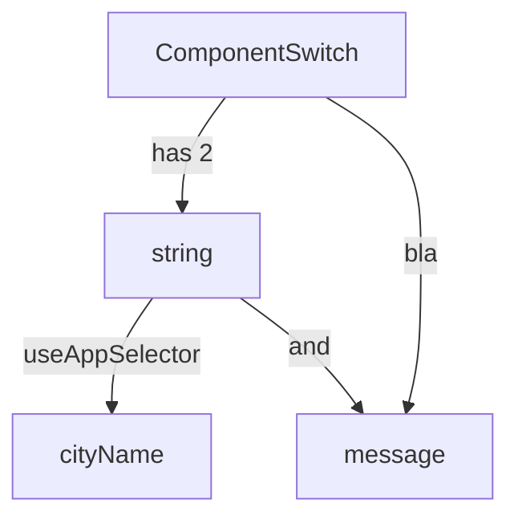

<!--MERMAID {width:100}-->

<!--MCONTENT {content: graph
A\[`ComponentSwitch`[<sup id="1Lv3q4">↓</sup>](#f-1Lv3q4)\] \-\-\>|has 2| B\[`string`[<sup id="ZNqm3D">↓</sup>](#f-ZNqm3D)\]
B \-\-\>|`useAppSelector`[<sup id="19aWr0">↓</sup>](#f-19aWr0)| C\[`cityName`[<sup id="Z1ktulH">↓</sup>](#f-Z1ktulH)\]
B \-\-\>|and| D\[`message`[<sup id="RYM8r">↓</sup>](#f-RYM8r)\]
A \-\-\>|bla| D} --->

<br/>

This here above is a mermaid graph


<br/>


<!-- NOTE-swimm-snippet: the lines below link your snippet to Swimm -->
### 📄 src/features/component-switch/component-switch.tsx
```tsx
⬜ 4      import {WeatherDisplay} from '../weather-display/weather-display';
⬜ 5      
⬜ 6      export function ComponentSwitch() {
🟩 7          const cityName: string = useAppSelector(selectCityName);
🟩 8          const message: string = useAppSelector(selectMessage);
🟩 9          const capitalizedName: string = cityName.replace(/\b(\w)/g, s => s.toUpperCase())
⬜ 10     
⬜ 11         return (
⬜ 12             <div>
```

<br/>

<!-- THIS IS AN AUTOGENERATED SECTION. DO NOT EDIT THIS SECTION DIRECTLY -->
### Swimm Note

<span id="f-Z1ktulH">cityName</span>[^](#Z1ktulH) - "src/features/component-switch/component-switch.tsx" L7
```tsx
    const cityName: string = useAppSelector(selectCityName);
```

<span id="f-1Lv3q4">ComponentSwitch</span>[^](#1Lv3q4) - "src/features/component-switch/component-switch.tsx" L6
```tsx
export function ComponentSwitch() {
```

<span id="f-RYM8r">message</span>[^](#RYM8r) - "src/features/component-switch/component-switch.tsx" L8
```tsx
    const message: string = useAppSelector(selectMessage);
```

<span id="f-ZNqm3D">string</span>[^](#ZNqm3D) - "src/features/component-switch/component-switch.tsx" L7
```tsx
    const cityName: string = useAppSelector(selectCityName);
```

<span id="f-19aWr0">useAppSelector</span>[^](#19aWr0) - "src/features/component-switch/component-switch.tsx" L7
```tsx
    const cityName: string = useAppSelector(selectCityName);
```

<br/>

This file was generated by Swimm. [Click here to view it in the app](https://swimm-web-app.web.app/repos/Z2l0aHViJTNBJTNBc3Rva2Utd2VhdGhlciUzQSUzQUFkZGllQ29oZW4=/docs/xpumv).